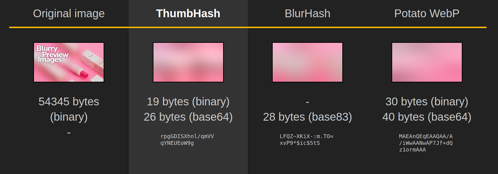
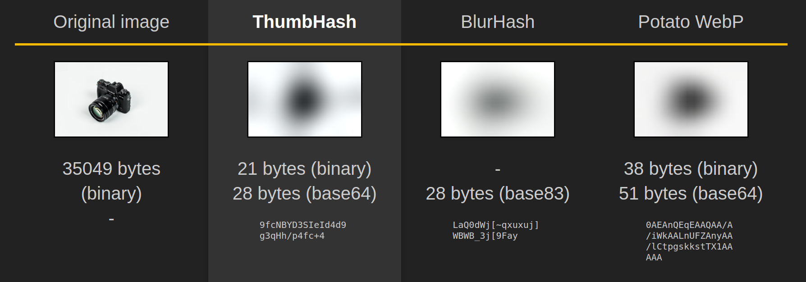
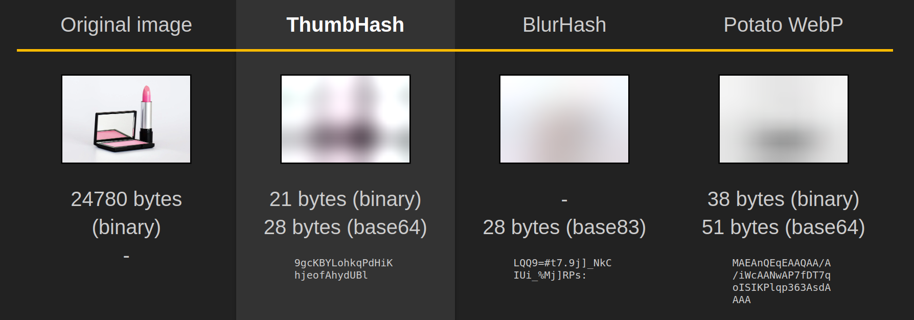
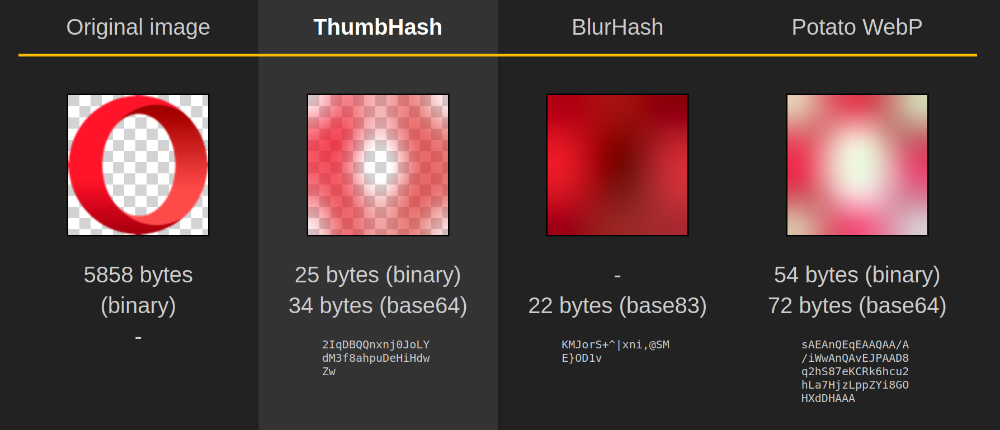

# Vendure Plugin: Blurry Image Lazy Loading

Generates image hashes for displaying blurry previews when loading images on the frontend.

## Features

- CustomField on `Asset` Entities containing a hash for your frontend.
- Automatic creation of hashes for new assets via event bus.
- Synchronous creation of hashes for direct consumption.
- Asynchronous creation of hashes via dedicated job queue.
- Out of the box comes with two different hashing strategies and can be extended if need be via a custom `PreviewImageHashStrategy`.
  - `ThumbHash` ([Reference](https://github.com/evanw/thumbhash))
  - `BlurHash` ([Reference](https://github.com/woltapp/blurhash))
- Suite of end-to-end tests ensuring correctness.

### End-To-End Tests

```
 ✓ blurry-image-lazy-loading/e2e/blurhash.e2e-spec.ts (8) 13006ms
 ✓ blurry-image-lazy-loading/e2e/common.e2e-spec.ts (9) 12031ms
 ✓ blurry-image-lazy-loading/e2e/thumbhash.e2e-spec.ts (8) 13508ms

 Test Files  3 passed (3)
      Tests  25 passed (25)
```

## Example comparisons

The [ThumbHash Website](https://evanw.github.io/thumbhash/) has an interactive online comparison generator.









## How To: Usage

The plugin adds a couple ways to generate hashes for you to the admin api endpoint.
Your admin-client needs the `CreateAsset` Vendure permission in order to call the following mutations. See [resolver](./src/api/admin.resolver.ts).

```gql
extend type Mutation {
  """
  Create a preview image hash for one image.
  """
  pluginPreviewImageHashCreateImageHash(
    input: PluginPreviewImageHashCreateInput!
  ): PluginPreviewImageHashCreateResult!

  """
  Create preview image hashes for an entire collection.
  This includes the collection, the contained Product-assets and related ProductVariant-assets.
  """
  pluginPreviewImageHashCreateImageHashesForCollection(
    input: PluginPreviewImageHashForCollectionInput!
  ): PluginPreviewImageHashResult!

  """
  Create preview image hashes for a product.
  This includes both the product itself and all of its ProductVariant assets.
  """
  pluginPreviewImageHashCreateImageHashesForProduct(
    input: PluginPreviewImageHashForProductInput!
  ): PluginPreviewImageHashResult!
}
```

See [api-extensions.ts](./src/api/api-extensions.ts) for a complete overview of the graphql extensions and types.

### 1. Add the plugin to your Vendure Config

The simplest way is relying on the defaults and just adding the plugin with a hashing strategy.

```ts
export const config: VendureConfig = {
  // ...
  plugins: [
    PreviewImageHashPlugin.init({
      hashingStrategy: new ThumbHashStrategy(), // Recommended
    }),
  ],
}
```

It's possible to pass in further configurations into both the plugin and the strategies, for example:

```ts
PreviewImageHashPlugin.init({
  enqueueHashingAfterAssetCreation: false,
  hashingStrategy: new ThumbHashStrategy({
    encoding: "hex",
    resizeOptions: {
      width: 32,
      fit: "contain"
    }
  }),
})
```

Please refer to the specific [docs](./src/types.ts) for how and what you can customize.

### 2. Generate hashes

By default the option `enqueueHashingAfterAssetCreation` automatically adds hashing tasks to the dedicated job queue for newly added assets.

For existing assets you can produce hashes either synchronously or via the job queue, of which the latter is recommended for production environments, via the admin API:

```graphql
mutation {
  pluginPreviewImageHashCreateImageHash(
    input: {
      idAsset: "example123",
      runSynchronously: true,  # False by default
    }
  ) {
    # When running asynchronously you get a short status response.
    ... on PluginPreviewImageHashResult {
      code
      jobsAddedToQueue
      message
    }

    # When running synchronously, you get the Asset directly.
    # This is useful for scripts.
    ... on Asset {
      id
      name
      customFields {
        previewImageHash
      }
    }
  }
}
```

### 3. Consume the hashes in your frontend

Now that your assets have hashes you may consume them on your frontend. How and where you consume them exactly is dependent on your setup, but in general it involves the following steps.

1. Retrieve assets, for example:

```graphql
query {
  collection(slug: "example") {
    productVariants(options: { take: 10 }) {
      items {
        name
        featuredAsset {
          preview
          width
          height
          customFields {
            previewImageHash
          }
        }
      }
    }
  }
}
```

2. For example with the `ThumbHashStrategy` and its `BufferEncoding` set to the default `"base64"` you can now decode the hashes with the [provided helper](https://github.com/evanw/thumbhash/blob/a652ce6ed691242f459f468f0a8756cda3b90a82/js/thumbhash.js#L278-L288) like so:
    
```ts
const buffer = Buffer.from(previewImagehash, "base64");
const dataUrl = thumbHashToDataURL(buffer);
```

3. Use the result in your frontend, for example in an imaginary react component.

```jsx
<MyCustomImgComponent
  previewSrc={dataUrl}
  src={asset.preview}
  width={asset.width}
  height={asset.height}
/>
```

---

#### Credits

- Original Banner Photo by [Ray Piedra](https://www.pexels.com/@craytive/) from [Pexels](https://www.pexels.com/photo/beauty-product-in-pink-color-2720447/), edited by [Daniel Biegler](https://www.danielbiegler.de/)
- Lipstick Photo by [Suzy Hazelwood](https://www.pexels.com/@suzyhazelwood/) from [Pexels](https://www.pexels.com/photo/close-up-photo-of-pink-lipstick-and-blush-on-2533266/)
- Camera Photo by [Math](https://www.pexels.com/@madebymath/) from [Pexels](https://www.pexels.com/photo/black-fujifilm-dslr-camera-90946/)
