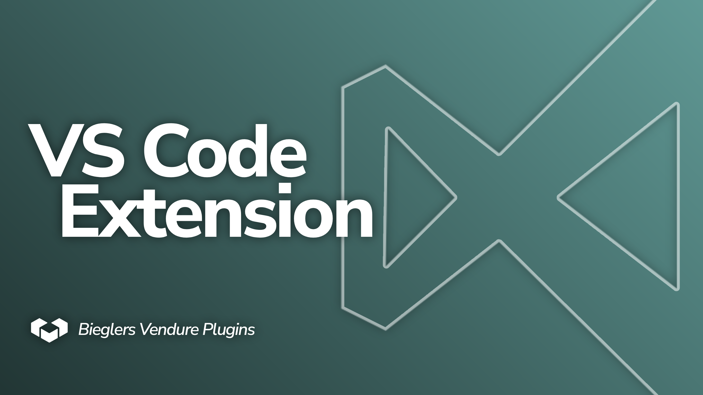
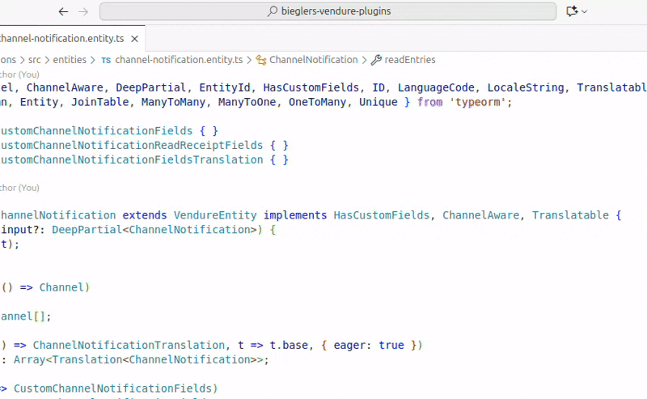

# Bieglers Vendure Helper

VS Code Extension to improve working on Vendure projects.

## Features

### Docs Search

- Quickly find relevant Vendure Docs and open them in your browser
- Copy the URL of the highlighted item either by button or pressing `CTRL+C` (`CMD+C` on Mac)



> [!TIP]
> 1. The extension adds the shortcut: `CTRL+K V` (`CMD+K V` on Mac) to directly open the QuickPick menu.
> 2. Select text in your editor before launching the QuickPick Menu to automatically use your selected text as input.

## Requirements

* None

## Download

You can find extensions to download in the [`./downloads`](./downloads/) folder.

## Installation

Local VS Code extensions are bundled into a `.vsix` files and can be installed by running this in your shell:

```shell
code --install-extension "./path/to/the/extension.vsix"
```

## Extension Settings

This extension contributes the following settings:

* None

## Known Issues

* None
