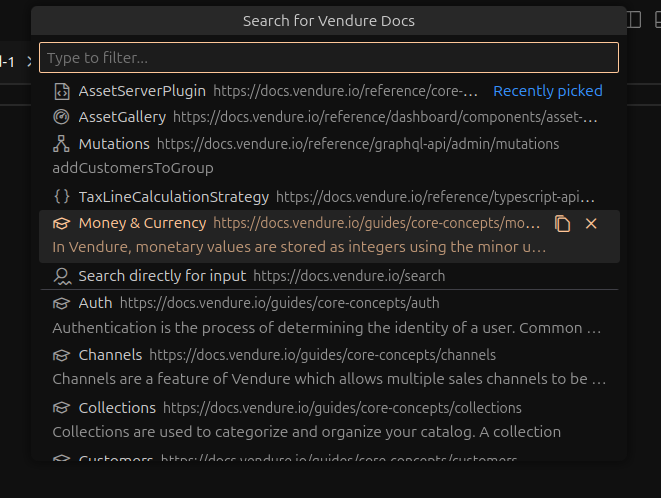

# Bieglers Vendure Helper

VS Code Extension to improve working on Vendure projects.

## Features

### Docs Search



- Quickly find relevant Vendure Docs and open them or copy the URL to your clipboard directly via `CTRL+C` (`CMD+C` on Mac)
- Configure to open Vendure Docs either directly inside VsCode or in your browser
- Localization support for English, German, Russian
  - To add your own language please open a PR with new `./package.nls.??.json` and `./l10n/bundle.l10n.??.json` files, where `??` represents your languages ISO code. See [vscode-api](https://code.visualstudio.com/api/references/vscode-api#l10n) for more details.

> [!TIP]
> 1. The extension adds the shortcut: `CTRL+K V` (`CMD+K V` on Mac) to directly open the QuickPick menu.
> 2. Select text in your editor before launching the QuickPick Menu to automatically use your selected text as input.

## Requirements

* None

## Download

Check the [`./CHANGELOG.md`](./CHANGELOG.md) to see what's new and then you can find extensions to download in the [`./downloads`](./downloads/) folder.

## Installation

Local VS Code extensions are bundled into a `.vsix` files and can be installed by running this in your shell:

```shell
code --install-extension "./path/to/the/extension.vsix"
```

## Extension Settings

This extension contributes the following settings:

* `openInternally`
    * Whether or not to open the documentation links via the builtin VsCode extension \"simpleBrowser\" which should be enabled by default. Disabling this option will open the documentation links externally in your native browser.

## Known Issues

* None
